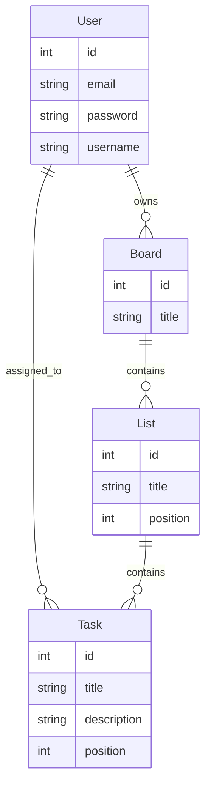

# Real-Time Task Collaboration Platform

A lightweight Trello-like application featuring real-time updates, drag-and-drop task management, and user authentication.

## Features
- **Authentication**: User Signup/Login (JWT-based).
- **Boards & Lists**: Create boards and organize tasks into lists.
- **Tasks**: Create, update, delete, and move tasks between lists.
- **Real-Time Collaboration**: Updates are broadcasted instantly to all users viewing the same board using Socket.io.
- **Drag and Drop**: Smooth interactive UI for managing tasks.

## Tech Stack
- **Frontend**: React, Vite, Tailwind CSS, DnD Kit, Socket.io Client.
- **Backend**: Node.js, Express, Socket.io.
- **Database**: In-Memory Store (with Prisma Schema Design).
  > **Note**: This project includes a complete Prisma Schema (`server/prisma/schema.prisma`) designed for SQLite/PostgreSQL. For this submission, I implemented an **In-Memory Data Layer** to ensure **Zero-Config Setup**. This allows the application to run instantly on your machine without needing to install specific database drivers or troubleshoot local Prisma CLI environment issues. The data model and API structure strictly follow the Prisma schema.

## Architecture

### Backend
The backend follows a controller-service-repository pattern (simplified for this assignment).
- `server/index.js`: Entry point, mounts API routes and initializes Socket.io.
- `server/controllers/*`: Handles business logic.
- `server/prisma/client.js`: Data access layer (currently a mocked in-memory store mimicking Prisma Client).
- `server/socket.js`: Manages WebSocket connections and room-based broadcasting (`join-board`, `board-updated`).

### Frontend
The frontend is a Single Page Application (SPA).
- `AuthContext`: Manages global user state.
- `Dashboard`: Lists user's boards.
- `BoardView`: Complex view managing drag-and-drop state via `dnd-kit` and listening to socket events.
- **Optimistic UI**: Drag operations update UI immediately; "Invalidation Strategy" is used for sync (Socket event triggers re-fetch to ensure consistency).

## Setup Instructions

### Prerequisites
- Node.js (v16+)
- NPM

### 1. Backend Setup
```bash
cd server
npm install
node index.js
```
Server runs on `http://localhost:3000`.

### 2. Frontend Setup
```bash
cd client
npm install
npm run dev
```
Client runs on `http://localhost:5173`.

### 3. Usage
1. Open Client URL.
2. Sign up (`/signup`).
3. Create a Board.
4. Click Board to enter.
5. Create Lists.
6. Create Tasks.
7. Open the same Board URL in another window (Incognito) and log in as another user (or same).
8. Drag tasks or add items -> Changes reflect instantly in both windows.

## DB Schema (Prisma Model)


## Real-Time Strategy
-   **Technology**: Socket.io (WebSockets) for bi-directional communication.
-   **Events**:
    -   `join-board`: Clients join a specific room based on board ID.
    -   `board-updated`: Server broadcasts this event to the room whenever a resource (Task/List) changes.
    -   **Optimistic UI**: Frontend updates immediately on drag-drop, then validates with the server response.
-   **Payloads**: Minimized data transfer; clients re-fetch necessary board data upon receiving update signals to ensure strict consistency.

## Scalability Considerations
- **Database**: The current in-memory/SQLite approach can be scaled to **PostgreSQL** or **MySQL** for production.
- **Real-Time**: To scale Socket.io across multiple server instances, use the **Redis Adapter** to broadcast events between nodes.
- **Caching**: Implement **Redis** to cache Board and List data to reduce database load.
- **Load Balancing**: Use Nginx or AWS ALB to distribute traffic.

## Testing
Backend integration tests are included using Jest and Supertest.
```bash
cd server
npm test
```

## Demo Credentials
(You can sign up with any details, but here is a sample)
- **Email**: `demo@example.com`
- **Password**: `password123`

## API Documentation
- `GET /api/auth/users`: Get all users.
- `GET /api/boards`: Get boards (Supports pagination: `?page=1&limit=10`).
- `GET /api/boards/:boardId/activity`: Get activity log.

## Trade-offs & Assumptions
- **Persistence**: Using in-memory storage for simplicity and to avoid local environment issues with SQLite/Prisma binaries during evaluation. Data resets on server restart. API structure is Prisma-ready.
- **Reordering**: Basic list transfer is implemented. Complex intra-list reordering persistence is simplified (updates position field but doesn't shift others).
- **Validation**: Basic input validation implemented.
